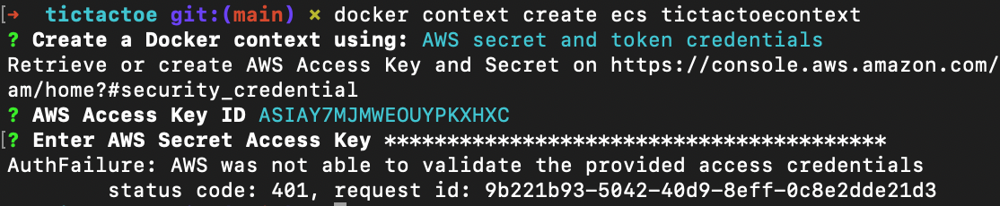
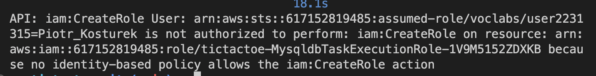

# Tic tac toe app
## Aplikacja
Aplikacja została napisana w następującym stacku technologicznym:
- baza danych: MySQL
- backend: node.js + express.js + socket.io + sequelize
- frontend: javascript + React

W bazie danych trzymane są dane użytkowników oraz pojedynków między nimi. Aplikacja pozwala na rejestrację, logowanie, przeglądanie wyników poszczególnych graczy oraz grę w kółko i krzyżyk. Do autentykacji użytkownika wykorzystywany jest token JWT. Po uruchomieniu gry użytkownik czeka na kolejnego gracza który uruchomi grę i wtedy zaczyna się pojedynek. Rozpoczynanie, rozgrywka i zakończenie pojedynku opiera się na websocketach.


## Docker
W celu uruchomienia aplikacji tworzone są 3 serwisy:
- mysqldb
- tictactoe_backend
- tictactoe_frontend

Ich konfigurację można obejrzeć w plikach `Dockerfile` dla frontendu i backendu oraz w pliku `docker-compose.yml`.

Jednym z głównych problemów przy konfiguracji kontenerów było niepoprawne działanie routingu w aplikacji (oparta jest ona o [react-router](https://reactrouter.com/)). W celu umożliwienia poprawnego działania, należało odpowiendio skonfigurować serwer NGINX, aby wiedział gdzie szukać odpowiednich plików:
```NGINX
server {
    listen 80;
    location / {
        root   /usr/share/nginx/html;
        index  index.html index.htm;
        try_files $uri $uri/ /index.html;
    }
}
```
Z kolei w pliku `Dockerfile` dla frontendu należało usunąć domyślną konfigurację NGINXa i podstawić powyższą:
```Docker
COPY --from=build-stage /tictactoe-frontend/build /usr/share/nginx/html
RUN rm /etc/nginx/conf.d/default.conf
COPY nginx.conf /etc/nginx/conf.d
```
## Uruchomienie aplikacji na AWSie

### Docker context
Uruchomiono komendę:
```
docker context create ecs tictactoecontext
```
W pierwszej kolejności wybrano opcję `Create context using AWS secret and token credentials`. Niestety wtedy pojawiał się błąd:


Następnie wydzielono zmienne uwierzytelniające do zmiennych systemowych:
- `AWS_ACCESS_KEY_ID`
- `AWS_SECRET_ACCESS_KEY`
- `AWS_DEFAULT_REGION`

Niestety wtedy przy dalszych krokach pojawiał się błąd `UnrecognizedClientException: The security token included in the request is invalid.
	status code: 400, request id: 53bb36ce-164d-48b4-8647-1fa42090745f`
Ostatecznie zainstalowano na komputerze AWS CLI, skonfigurowano profil i przy tworzeniu kontekstu wybrano opcję `Create context using existing AWS profile` i tym razem kontekst utworzył się poprawnie.

Następnie wykonano komendę
```
docker context use tictactoecontext
```

po wykonaniu `docker compose up` pojawił się komunikat o błędzie
`service tictatoe-frontend doesn't define a Docker image to run: incompatible attribute`. 

Spushowano więc obrazy do docker huba oraz dodano atrybuty `image` do serwisów frontend i backend.

Tym razem `docker compose up` spowodował błąd `published port can't be set to a distinct value than container port: incompatible attribute` zmieniono więc mapowania portów na:
- 6379:6379 dla backendu
- 8080:8080 dla frontendu
- 3306:3306 dla bazy danych

docker compose up powoduje jednak błąd:

Któremu autor nie wie jak zaradzić i poddał się na tym etapie.
