# Tic tac toe app
## Aplikacja
Aplikacja została napisana w następującym stacku technologicznym:
- baza danych: MySQL
- backend: node.js + express.js + socket.io + sequelize
- frontend: javascript + React

W bazie danych trzymane są dane użytkowników oraz pojedynków między nimi. Aplikacja pozwala na rejestrację, logowanie, przeglądanie wyników poszczególnych graczy oraz grę w kółko i krzyżyk. Do autentykacji użytkownika wykorzystywany jest token JWT. Po uruchomieniu gry użytkownik czeka na kolejnego gracza który uruchomi grę i wtedy zaczyna się pojedynek. Rozpoczynanie, rozgrywka i zakończenie pojedynku opiera się na websocketach.


## Docker
W celu uruchomienia aplikacji tworzone są 3 serwisy:
- tictactoe_backend
```Dockerfile
FROM node:16
WORKDIR /tictactoe-backend
COPY package.json .

RUN npm install

COPY . .
EXPOSE 8080
CMD npm start

```
- tictactoe_ui
```Dockerfile
FROM node:16 as build-stage

WORKDIR /tictactoe-ui
COPY package.json .
RUN npm install
COPY . .

ARG REACT_APP_API_BASE_URL
ENV REACT_APP_API_BASE_URL=$REACT_APP_API_BASE_URL

RUN npm run build

FROM nginx

COPY --from=build-stage /tictactoe-ui/build /usr/share/nginx/html
RUN rm /etc/nginx/conf.d/default.conf
COPY nginx.conf /etc/nginx/conf.d

EXPOSE 3000

CMD nginx -g 'daemon off;'

```
- tictactoe-router (pełni rolę Reverse Proxy)
```Dockerfile
FROM nginx
COPY ./default.conf /etc/nginx/conf.d/default.conf
EXPOSE 80
```
plik koniguracyjny routera:
```

upstream tictactoe-ui {
    server tictactoe-ui:3000;
}
upstream tictactoe-backend {
    server tictactoe-backend:8080;
}

server {
    listen 80;

    location / {
        proxy_pass http://tictactoe-ui;
    }
    location /api {
        proxy_pass http://tictactoe-backend;
    }
    location /socket.io {
        proxy_set_header X-Forwarded-For $proxy_add_x_forwarded_for;
        proxy_set_header Host $host;

        proxy_pass http://tictactoe-backend;
        proxy_http_version 1.1;
        proxy_set_header Upgrade $http_upgrade;
        proxy_set_header Connection "upgrade";
    }
}
```

Plik `docker-compose-cloud.yml`:
```
version: '3.8'

services:
  tictactoe-backend:
    build: ./backend
    image: 617152819485.dkr.ecr.us-east-1.amazonaws.com/tictactoe-backend:latest
    restart: unless-stopped
    ports:
      - $API_PORT:$API_PORT

  tictactoe-ui:
    depends_on:
      - tictactoe-backend
    build:
      context: ./frontend
      args:
        - REACT_APP_API_BASE_URL=http://tictactoe-env-3.eba-if7pe5ei.us-east-1.elasticbeanstalk.com
    image: 617152819485.dkr.ecr.us-east-1.amazonaws.com/tictactoe-ui:latest
    ports:
      - 3000:3000

  tictactoe-router: 
    container_name: tictactoe-router
    depends_on: 
      - tictactoe-ui
      - tictactoe-backend
    ports: 
      - 80:80
    build:
      context: ./router
    image: 617152819485.dkr.ecr.us-east-1.amazonaws.com/tictactoe-router:latest
```

baza danych jest wdrażana jako instancja RDS - nie jest definiowana jako serwis w pliku `docker-compose-cloud.yml`. Poniżej znajduje się poglądowy schemat deploymentu aplikacji:

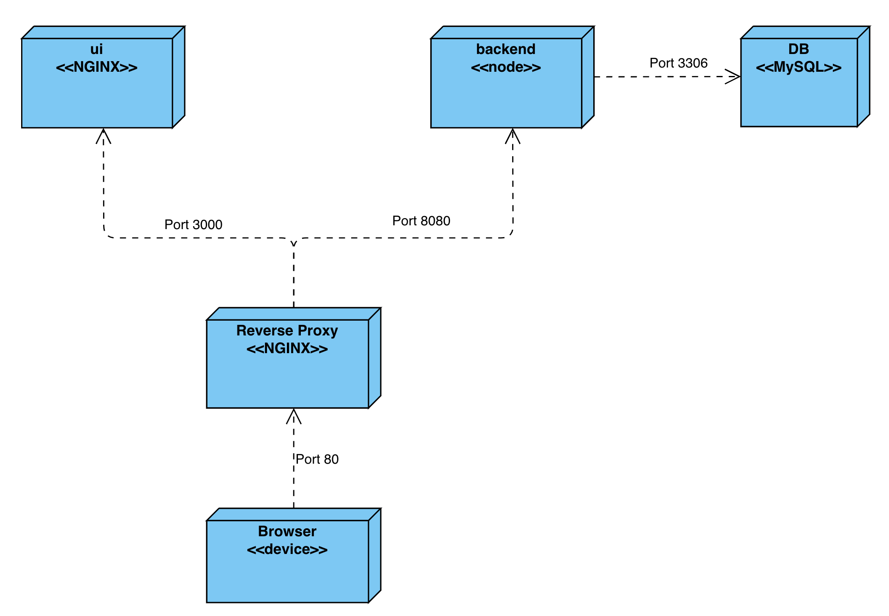

## Deployment aplikacji z wykorzystaniem Elastic Beanstalk, ECR oraz RDS

## ECR
Należy utworzyć 3 repozytoria w usłudze ECR za pomocą przycisku `Create Repository`. Są to repozytoria prywatne i mają wszystkie ustawienia domyślne.

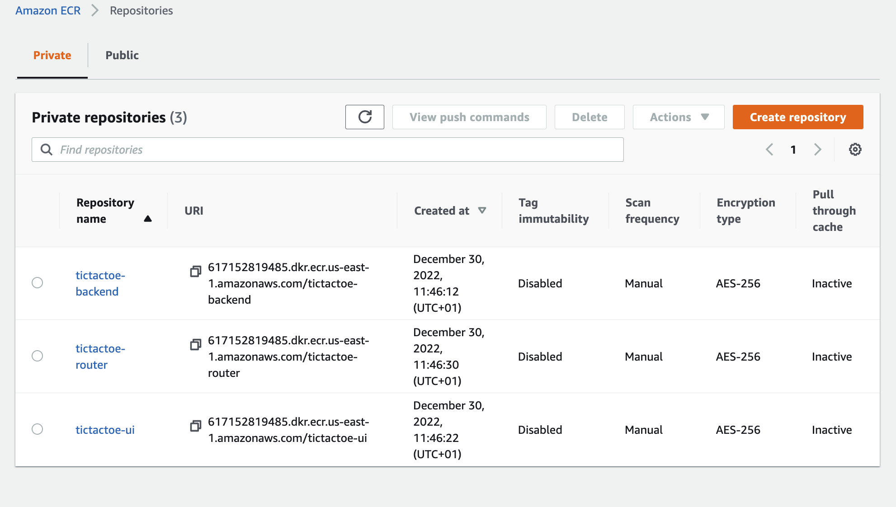

W celu zbudowania i wrzucenia obrazów należy wykonać poniższe polecenia, uprzednio konfigurując odpowiednie credentiale w pliku `~/.aws/credentials` (należy je pobrać z Learner's Lab).
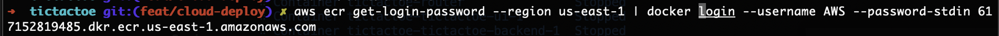
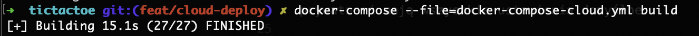
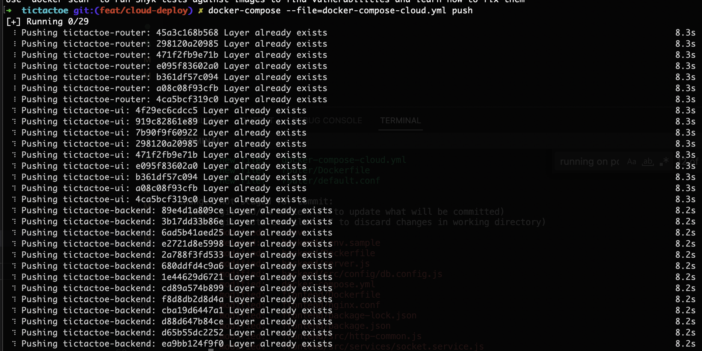

## Elastic Beanstalk
W usłudze EB należy utworzyć nowe środowisko oraz aplikację, która wykorzysta opisane wcześniej kontenery z usługi ECR.
W tym celu należy przygotować plik `Dockerrun.aws.json`, który stanowi opis deploymentu zestawu kontenerów Dockerowych jako aplikacji EB.

```json
{
    "AWSEBDockerrunVersion": 2,
    "containerDefinitions": [
        {
            "name": "tictactoe-backend",
            "image": "617152819485.dkr.ecr.us-east-1.amazonaws.com/tictactoe-backend:latest",
            "memory": 256,
            "essential": true,
            "portMappings": [
                {
                    "hostPort": 8080,
                    "containerPort": 8080
                }
            ]
        },
        {
            "name": "tictactoe-ui",
            "image": "617152819485.dkr.ecr.us-east-1.amazonaws.com/tictactoe-ui:latest",
            "memory": 512,
            "essential": true,
            "portMappings": [
                {
                    "hostPort": 3000,
                    "containerPort": 3000
                }
            ]
        },
        {
            "name": "tictactoe-router",
            "image": "617152819485.dkr.ecr.us-east-1.amazonaws.com/tictactoe-ui:latest",
            "memory": 128,
            "essential": true,
            "portMappings": [
                {
                    "hostPort": 80,
                    "containerPort": 80
                }
            ],
            "links": [
                "tictactoe-ui",
                "tictactoe-backend"
            ]
        }
    ]
}
```
Poniżej krótko wyjaśniono poszczególne atrybuty:
- `"AWSEBDockerrunVersion": 2` - wersja 2 jest dedykowana dla środowisk Dockerowych zarządzanych przez ECS
- `"containerDefinitions"` - lista definicji kontenerów
- `"name"` - nazwa kontenera
- `"image"` - nazwa obrazu dockerowego, z którego budowany będzie kontener
- `"essential"` - wartość true oznacza, że jeśli dany kontener padnie to wszystkie kontenery powinny zostać wyłączone.
- `"memory"` - określa rozmiar pamięci w MB
- `"portMappings"` - określa mapowania portów na maszynie-hoście do portów w kontenerze
- `"links"` - lista kontenerów, z którymi można się bezpiecznie łączyć

Środowisko skonfigurowano w poniższy sposób. Ustawienia, które nie są pokazane na poniższych screenach mają wartości domyślne.
 Jako platformę wybrano ECS AL2, gdyż jest to platforma dedykowana dla wielokontenerowych aplikacji dockerowych.
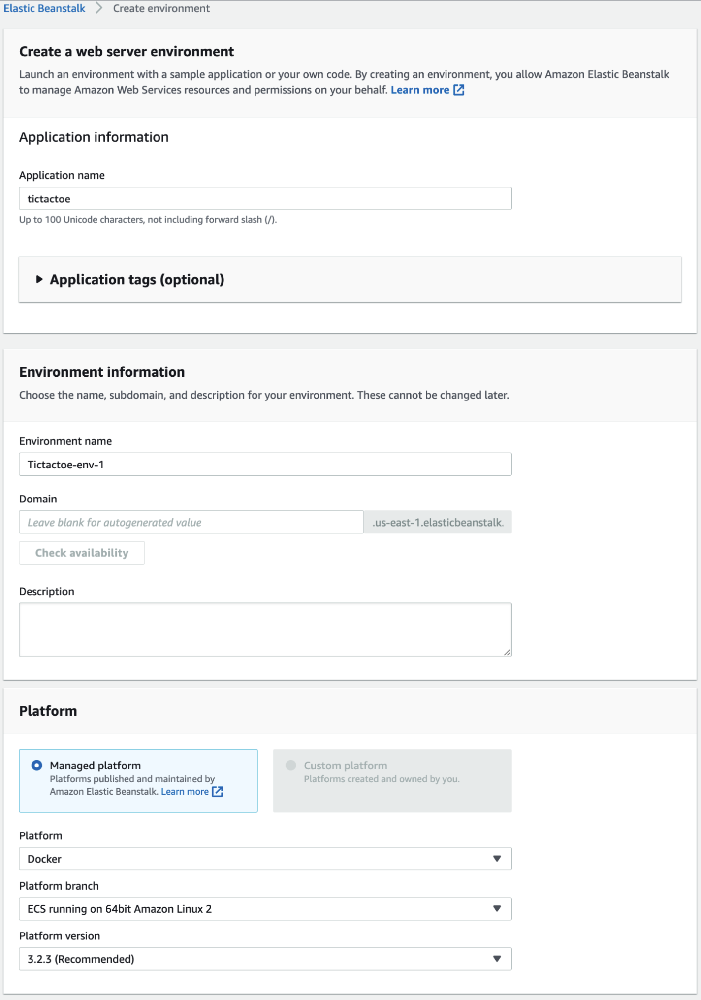
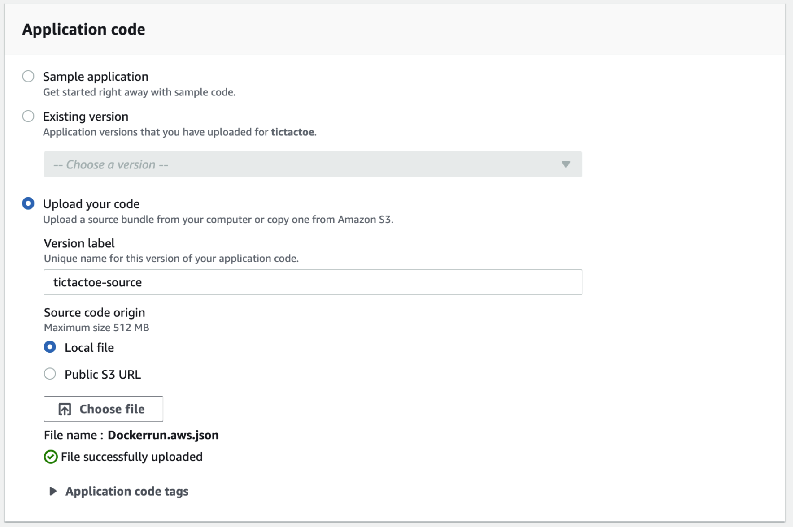

Aby środowisko powstało, należy podać odpowiednie uprawnienia zgodnie z instrukcją do Laba:
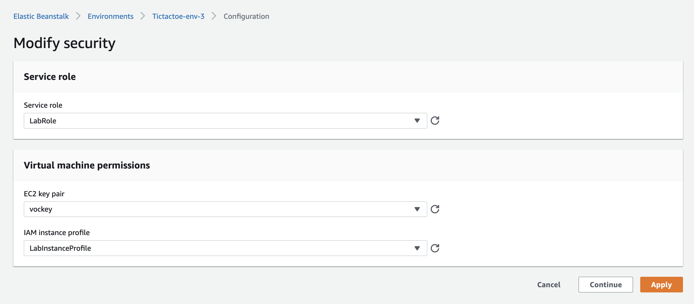

Postanowiono wykorzystać w aplikacji load balancera. W tym celu jako environment wybrano wartość `Load Balanced`
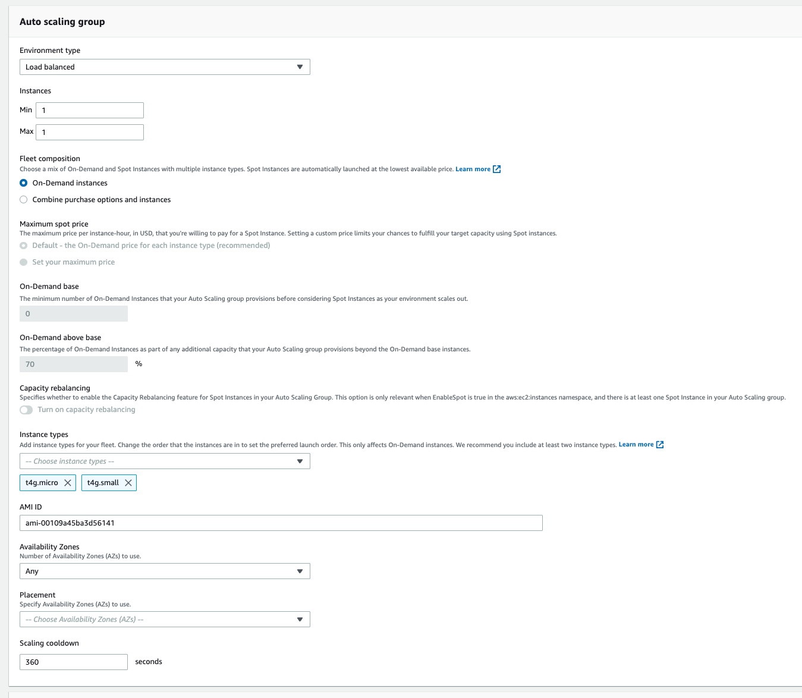


Następnie w zakładce `Load Balancer` wybrano `Application` jak typ LB oraz dodano Listenery, Process oraz Rules w celu odpowiedniego przekierowywania zapytań:
- o frontend - zapytania na port 80 bez ścieżki są przekierowywane na port 3000, 
- zapytań do api - zapytania na port 80 ze ścieżką /api/* są przekierowywane na port 8080 
- zapytań websocketowych wykorzystywanych przy rozgrywaniu meczu - zapytania na port 80 ze ścieżką /socket.io* są przekierowywane na port 8080.
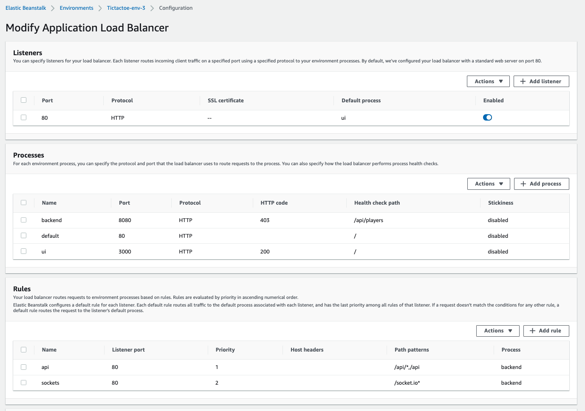

## Baza danych
Dodaną zintegrowaną ze środowiskiem bazę danych RDS z poziomu konfiguracji aplikacji. Jako silnik wybrano MySQL oraz dodano odpowiednie wartości zmiennych.
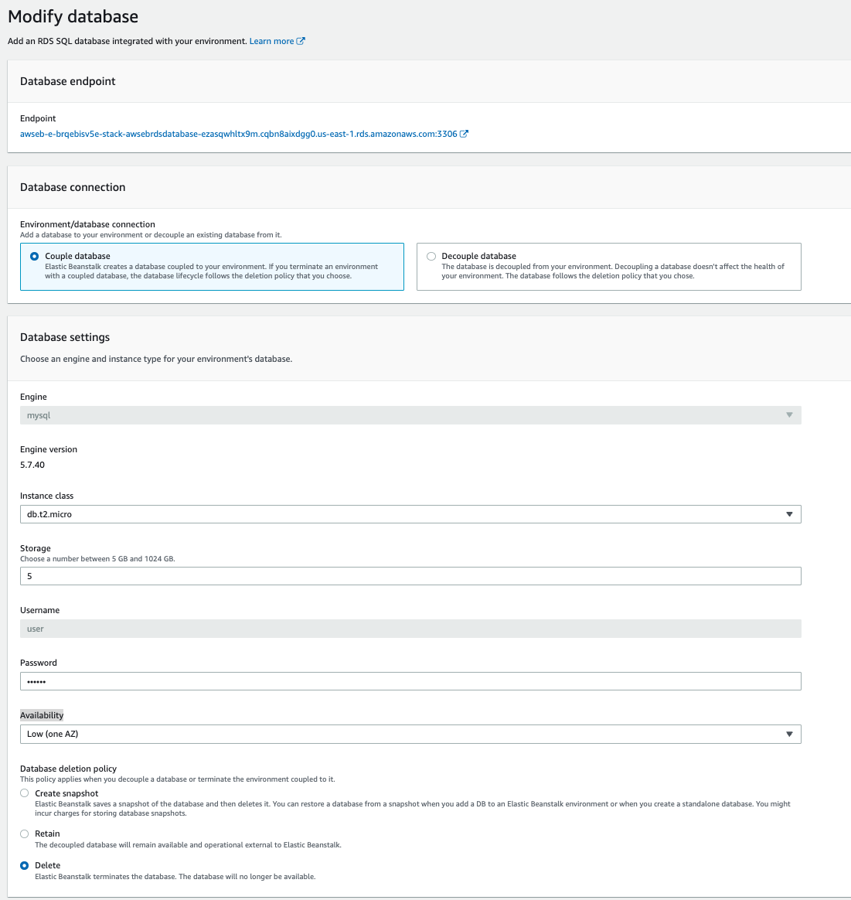

Aby połączyć się z bazą należy wykorzystać zmienne systemowe z przedrostkiem `RDS_`. Plik `db.config.js`:
```js
module.exports = {
    HOST: process.env.RDS_HOSTNAME,
    USER: process.env.RDS_USERNAME,
    PASSWORD: process.env.RDS_PASSWORD,
    DB: process.env.RDS_DB_NAME,
    port: process.env.RDS_PORT,
    dialect: "mysql",
    pool: {
        max: 5,
        min: 0,
        acquire: 30000,
        idle: 10000
    }
};
```
## Działanie aplikacji
Poniższe zrzuty ekranu pokazują, że aplikację udało się pomyślnie zdeployować:
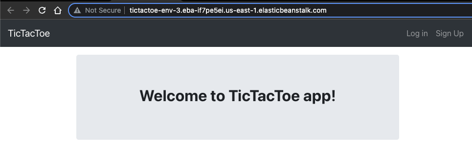

Request o zalogowanie:

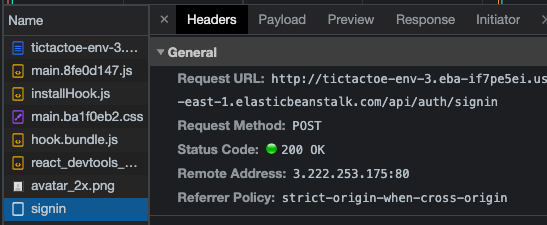

Komunikacja przez websockety:
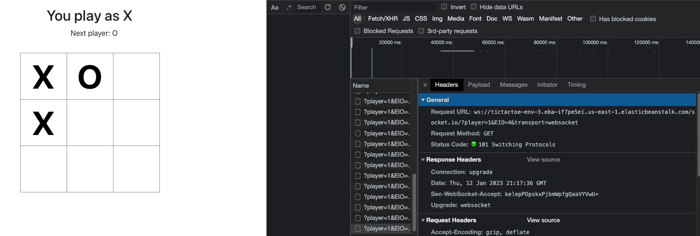

Odczytane dane z bazy:
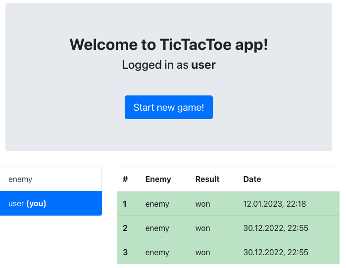
